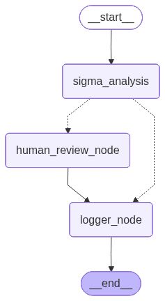

# Kaizen-Sigma Methodology: Lattice Auditor 🛡️📉

> **Continuous Improvement (PDCA) meets Statistical Rigor (Six Sigma).**

Welcome to the **Kaizen-Sigma Methodology** repository. This project is a specialized transformation of the Sigma Lattice Auditor, pivoted towards an autonomous, self-healing framework for continuous measurement, waste reduction (**Muda**), and standardized work stability.

---

## Agentic PDCA Workflow Architecture



## 🏗️ The Kaizen-Sigma Architecture

This repository implements a fully autonomous DMAIC / PDCA loop:

1. **Measure & Analyze**: Generate synthetic logs and track waste (Muda).
2. **SPC & Trend Intelligence**: Monitor real-time process stability using Western Electric / Nelson Rules and rolling Cpk trajectory.
3. **Autonomous Check**: Evaluate capability against the **1.33 Cpk Production Gate** and **3.4 DPMO Limit**.
4. **Self-Heal (Auto-Remediation)**: Iteratively tighten variance automatically when the process drifts out of control, governed by a Loop Guard.
5. **Act**: Update process standards securely to prevent quality backsliding.

---

## 📊 Core Components

### 🔄 Autonomous Workflow (`scripts/audit_engine/`)
- **`agent_orchestrator.py`**: The main agentic control node. Orchestrates SPC checks, capability analysis, and self-healing.
- **`auto_remediation.py`**: A variance-tightening sub-agent that drives Cpk back above the gate when `INTERVENTION_REQUIRED` is triggered.
- **`kaizen_dashboard.py`**: Generates a rich 5-panel dark-mode dashboard (Muda Decay, PCE, Lead Time, Cpk Trend, Loop Guard Status).
- **`kaizen_data_gen.py` & `pdca_act.py`**: Legacy data generation and standard updating layers.

### 🧠 Statistical Intelligence (`src/auditor/`)
- **`spc.py`**: Statistical Process Control implementing 8 Nelson Rules to catch non-random signals before they cause defects.
- **`trend.py`**: Rolling 30-event Cpk drift tracking and trajectory classification (`IMPROVING`, `STABLE`, `DEGRADING`).
- **`logic.py`**: Core Six Sigma (Cpk, Sigma Level) and Lean (PCE) math.

### 📜 Methodology & Standards (`methodology/`)
- **`standard_work/process_standards.md`**: Contains the **Automated Verification Thresholds**, Loop Guard policy, and the current "Best Practice" benchmarks.

---

## 🚀 Getting Started

### 📦 Installation

Ensure you have Python 3.11+ and a virtual environment ready:

```powershell
python -m venv venv
.\venv\Scripts\activate
pip install -r requirements.txt
pip install -e .
```

### 🛠️ Running the Pipeline Locally

1. **Execute the Full TDD Suite**:
    ```powershell
    python -m pytest tests/ -v --tb=short
    ```

2. **Run the Autonomous Control Node**:
    ```powershell
    # Triggers Check phase, Trend analysis, SPC, and Auto-Remediation (if needed)
    python scripts/audit_engine/agent_orchestrator.py
    ```

3. **Generate the 5-Panel Dashboard**:
    ```powershell
    python scripts/audit_engine/kaizen_dashboard.py
    ```
    *View `data/visuals/kaizen_dashboard.png`.*

---

## 📈 Quality Gates Verified

| Metric | Target / Gate | Action on Breach |
| :--- | :--- | :--- |
| **Cpk (Capability)** | **≥ 1.33** | Triggers Auto-Remediation Loop |
| **DPMO Estimate** | **≤ 64.0** | Alert logged in Audit Report |
| **SPC Status** | **IN_CONTROL** | Nelson rule violation logged for review |
| **Remediation Loops** | **≤ 3** | Pipeline halted (Human Escalation) |
| **Muda (Waste)** | **< 5.0 hrs** | Triggers Kaizen Blitz |

---

## 🛡️ Governance & Safety

Powered by the **Google Antigravity Pipeline** and **GitHub Actions** (`.github/workflows/kaizen_audit.yml`).
Every commit must pass 52+ TDD tests covering statistical boundaries, loop guard state machines, and edge cases before the orchestrator is allowed to run in CI.

_Ref: Kaizen Continuous Improvement (Pages 247-254) | DMAIC Control Phase_
